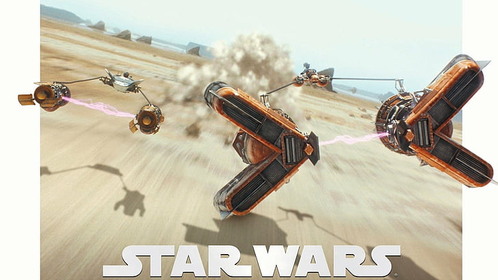
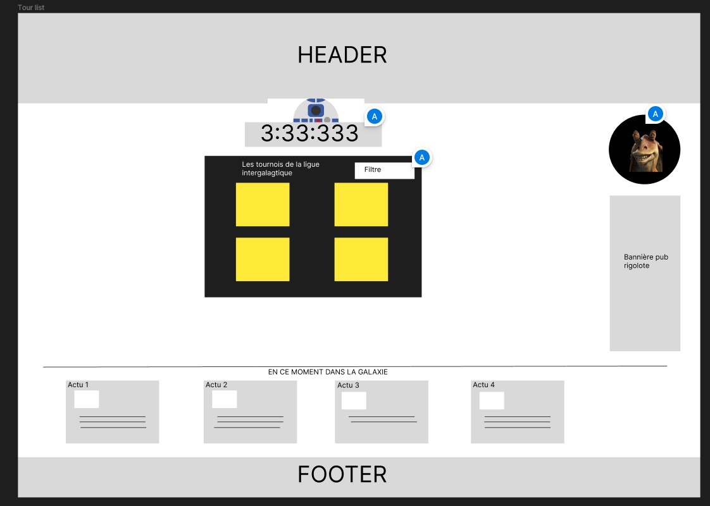

<div align='center'>
    <h1 id="top"><b>:checkered_flag: Intergalactic tournaments :checkered_flag:</b></h1>
    
    <p>WCS PROJECT [Hackathon #1]</b></p>


</div>

 <p align="center">
    <a href="https://newaluigi.github.io/"><strong>Explore the website »</strong></a>
    <br />
    <br />
    <a href="https://newaluigi.github.io/Intergalactic-tournament.svg/issues">Report Bug</a>
    ·
    <a href="https://newaluigi.github.io/Intergalactic-tournament.svg/issues">Request Feature</a>
  </p>
</div>

<details>
  <summary>Table of Contents</summary>
  <ul>
    <li><a href="#-about-the-project">About The Project</a></li>
    <li><a href="#-technologies">Technologies</a></li>
    <li><a href="#%EF%B8%8F-mock-up">Mock-up</a></li>
    <li><a href="#-installation">Installation</a></li>
    <li><a href="#-showcase">Showcase</a></li>
    <li><a href="#-ressources">Ressources</a></li>
    <li><a href="#-go-further">Go further</a></li>
    <li><a href="#-license">License</a></li>
    <li><a href="#%EF%B8%8F-contact">Contact</a></li>
  </ul>
</details>

---

## 🐔 **ABOUT THE PROJECT**

48 hours in team to discover and understand 𝗥𝗲𝗮𝗰𝘁, consuming an 𝗔𝗣𝗜 and build a website. The topic was Starwars universe. Initially the subject was about love encounter, but as we had already did love application for on the previous project we decided to produced about sport encounters, so in starwars the main one is pod racing tournament.
<br />
<br />
It's a front project, there is no back-end, so some random features are fake for the presentation.

<br />

<p align="right">(<a href="#top">back to top</a>)</p>

---

## 💻 **TECHNOLOGIES**

* Languages : 

* Style : 

* Framework : 

* Design : 

* Organization : 

* Remote team work :   

* IDE : 

<br />

<p align="right">(<a href="#top">back to top</a>)</p>

---

## ✏️ **MOCK-UP**

### Figma

Example of the tournament list page :
<br />


### Color Reference

| Color             | Hex                                                                |
| ----------------- | ------------------------------------------------------------------ |
| background-color |  #000000 |
| main-color |  #ffe81f |
| lightsaber-color |  #ff0000 |


<br />

### Font Reference

| Font             | Ref                                                                |
| ----------------- | ------------------------------------------------------------------ |
| main-font | **fontStarWars** |
| title-font | **fontStarWars** |

<br />

<p align="right">(<a href="#top">back to top</a>)</p>

---

## 💾 **INSTALLATION**

### Local installation:

1. clone the repo

```
git clone https://github.com/Newaluigi/Game_Date_Match.git
```

2. cd into cloned repo

```
cd repo
```
### Dependencies :

3. install dependencies

```
npm install
```
#### Specific packages on the project
* react-h5-audio-player

### Getting Started with Create React App :

This project was bootstrapped with [Create React App](https://github.com/facebook/create-react-app).

#### Available Scripts

In the project directory, you can run:

##### `npm start`

Runs the app in the development mode.\
Open [http://localhost:3000](http://localhost:3000) to view it in your browser.

The page will reload when you make changes.\
You may also see any lint errors in the console.

##### `npm test`

Launches the test runner in the interactive watch mode.\
See the section about [running tests](https://facebook.github.io/create-react-app/docs/running-tests) for more information.

##### `npm run build`

Builds the app for production to the `build` folder.\
It correctly bundles React in production mode and optimizes the build for the best performance.

The build is minified and the filenames include the hashes.\
Your app is ready to be deployed!

See the section about [deployment](https://facebook.github.io/create-react-app/docs/deployment) for more information.

##### `npm run eject`

**Note: this is a one-way operation. Once you `eject`, you can't go back!**

If you aren't satisfied with the build tool and configuration choices, you can `eject` at any time. This command will remove the single build dependency from your project.

Instead, it will copy all the configuration files and the transitive dependencies (webpack, Babel, ESLint, etc) right into your project so you have full control over them. All of the commands except `eject` will still work, but they will point to the copied scripts so you can tweak them. At this point you're on your own.

You don't have to ever use `eject`. The curated feature set is suitable for small and middle deployments, and you shouldn't feel obligated to use this feature. However we understand that this tool wouldn't be useful if you couldn't customize it when you are ready for it.

#### Learn More

You can learn more in the [Create React App documentation](https://facebook.github.io/create-react-app/docs/getting-started).

To learn React, check out the [React documentation](https://reactjs.org/).

##### Code Splitting

This section has moved here: [https://facebook.github.io/create-react-app/docs/code-splitting](https://facebook.github.io/create-react-app/docs/code-splitting)

##### Analyzing the Bundle Size

This section has moved here: [https://facebook.github.io/create-react-app/docs/analyzing-the-bundle-size](https://facebook.github.io/create-react-app/docs/analyzing-the-bundle-size)

##### Making a Progressive Web App

This section has moved here: [https://facebook.github.io/create-react-app/docs/making-a-progressive-web-app](https://facebook.github.io/create-react-app/docs/making-a-progressive-web-app)

##### Advanced Configuration

This section has moved here: [https://facebook.github.io/create-react-app/docs/advanced-configuration](https://facebook.github.io/create-react-app/docs/advanced-configuration)

##### Deployment

This section has moved here: [https://facebook.github.io/create-react-app/docs/deployment](https://facebook.github.io/create-react-app/docs/deployment)

##### `npm run build` fails to minify

This section has moved here: [https://facebook.github.io/create-react-app/docs/troubleshooting#npm-run-build-fails-to-minify](https://facebook.github.io/create-react-app/docs/troubleshooting#npm-run-build-fails-to-minify)


<p align="right">(<a href="#top">back to top</a>)</p>

---

## 🔎 **SHOWCASE**

### Key features
* Animated homepage
* Menu burger
* Interractive burger
* Gallery with API
* Game
* List of tournaments with a countdown

<br />

### Details

<br />

#### Homepage

<br />
<br />
<p align="center"> 

</p>

#### Tournament selection

<br />
<br />
<p align="center"> 

</p>

#### Character selection

<br />
<br />
<p align="center"> 

</p>

#### Game

<br />
<br />
<p align="center"> 

</p>


#### Tournament bracket

<br />
<br />
<p align="center"> 

</p>


<p align="right">(<a href="#top">back to top</a>)</p>

---

## 📚 **RESSOURCES**

### Homepage
* Menu burger : 
* Lecture animation :

### Tournament list
* compte à rebours :
* Ligne de séparation :
* audio play :

### Character list
* consommation API :

### Tournament
* bracket interractif : 

### Game
*  

<br />

<p align="right">(<a href="#top">back to top</a>)</p>

---

## 🔨 **GO FURTHER**

* Menu burger : add the close option or change the style (as https://codepen.io/Naito/embed/pgyOVm?default-tab=result&theme-id=299#css-box)
* Tournament Card : one participate button is not aligned, refactor the card, add more card style
* Tournament List : traduce the page in english, animate the hr as a lightsaber (https://codepen.io/lewisvrobinson/embed/OMNmJd?default-tab=result&theme-id=299#css-box) and reveal the actu section
* Counter : add an event to reveal the participate button of a tournament card when the countdown is over
* Character list : add some style ?
* Tournament bracket : real interractivity
* Game : integrate directly on the site, change for a race game ?

<br />

<p align="right">(<a href="#top">back to top</a>)</p>

---

## 📜 **LICENSE**

No specific licence

<br />

<p align="right">(<a href="#top">back to top</a>)</p>

---

## ✉️ **CONTACT**

[](https://github.com/Newaluigi/)

<br />
<p align="right">(<a href="#top">back to top</a>)</p>
